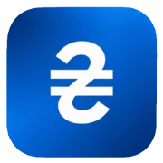
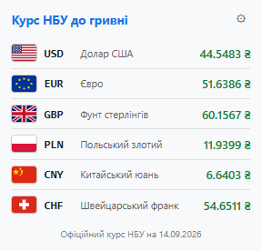
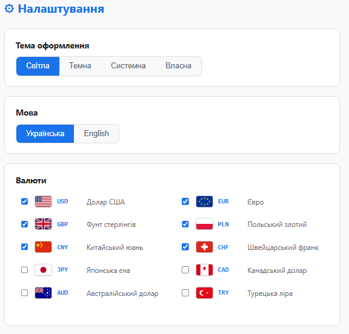
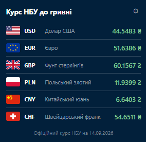

<div align="center">



# Курс НБУ

**Офіційний курс валют Національного банку України — завжди під рукою.**

[](https://addons.mozilla.org/ru/firefox/addon/%D0%BA%D1%83%D1%80%D1%81-%D0%BD%D0%B1%D1%83/)
[](#)
[](#)

[](https://developer.chrome.com/docs/extensions/mv3/intro/)
[](https://www.gnu.org/licenses/gpl-3.0)
[](http://makeapullrequest.com)
[](https://github.com/He-Trogati-Mne/NBU-Rate/stargazers)
[](https://github.com/He-Trogati-Mne/NBU-Rate/issues)
[](https://github.com/He-Trogati-Mne/NBU-Rate/commits)

<sub>Легке, швидке та повністю приватне розширення для перегляду курсів валют НБУ.</sub>

</div>

---

## Можливості

<table>
<tr>
<td width="50%" valign="top">

<h3>

</h3>

- **10 валют** — USD, EUR, GBP, PLN, CNY, CHF, JPY, CAD, AUD, TRY
- **Офіційні курси НБУ** з публічного API
- **Прапори країн** для кожної валюти
- **Вибір валют** — показуй лише те, що потрібно

<h3>

</h3>

- **4 теми** — Світла, Темна, Системна, Власна
- **Власна тема** з HEX-піпеткою та RGB
- **6 готових пресетів** — Midnight, Nord, Dracula, Sepia, Forest, Rose
- **Дві мови** інтерфейсу — Українська та English

</td>
<td width="50%" valign="top">

<h3>

</h3>

- **Миттєвий попап** завдяки кешуванню курсів
- **Оновлення раз на годину** у фоні
- **Бейдж на іконці** з поточним курсом USD
- **Стійкість до збоїв** — показує останній успішний курс

<h3>

</h3>

- **Жодної аналітики**
- **Жодного трекінгу**
- **Жодної реклами**
- **Єдиний запит** — до API НБУ

</td>
</tr>
</table>

---

## Скріншоти

<div align="center">

| Попап (світла тема) | Налаштування | Власна тема |
|:---:|:---:|:---:|
|  |  |  |

</div>

> Створи папку `screenshots/` у репозиторії та додай три PNG-файли з такими іменами: `popup-light.png`, `options.png`, `custom-theme.png`.

---

## Встановлення

### З магазинів (рекомендовано)

<table>
<tr>
<td align="center" width="33%">

<a href="https://addons.mozilla.org/ru/firefox/addon/%D0%BA%D1%83%D1%80%D1%81-%D0%BD%D0%B1%D1%83/">

</a>

**Firefox**
</td>
<td align="center" width="33%">


**Chrome**
</td>
<td align="center" width="33%">


**Edge**
</td>
</tr>
</table>

### Вручну (для розробників)

<details>
<summary><b>Firefox — покроково</b></summary>

1. Скачайте [останній реліз](https://github.com/He-Trogati-Mne/NBU-Rate/releases) або клонуйте репозиторій.
2. Відкрийте `about:debugging#/runtime/this-firefox`.
3. Натисніть **«Завантажити тимчасове доповнення»**.
4. Виберіть файл `manifest.firefox.json`.

</details>

<details>
<summary><b>Chrome — покроково</b></summary>

1. Скачайте [останній реліз](https://github.com/He-Trogati-Mne/NBU-Rate/releases) або клонуйте репозиторій.
2. Скопіюйте `manifest.chrome.json` у `manifest.json`:
   ```bash
   cp manifest.chrome.json manifest.json
   ```
3. Відкрийте `chrome://extensions/`.
4. Увімкніть **«Режим розробника»**.
5. Натисніть **«Завантажити розпаковане розширення»** і виберіть папку.

</details>

<details>
<summary><b>Edge — покроково</b></summary>

1. Скачайте [останній реліз](https://github.com/He-Trogati-Mne/NBU-Rate/releases) або клонуйте репозиторій.
2. Скопіюйте `manifest.edge.json` у `manifest.json`:
   ```bash
   cp manifest.edge.json manifest.json
   ```
3. Відкрийте `edge://extensions/`.
4. Увімкніть **«Режим розробника»**.
5. Натисніть **«Завантажити розпаковане розширення»** і виберіть папку.

</details>

---

## Використання

### Перегляд курсів

Клікніть на іконку розширення на панелі браузера — відкриється попап із курсами обраних валют. За замовчуванням показано 5 валют: USD, EUR, GBP, PLN, CNY.

### Налаштування

Натисніть шестерню в правому верхньому куті попапа. Відкриється сторінка налаштувань, де можна:

| Розділ | Що можна змінити |
|---|---|
| **Тема оформлення** | Світла / Темна / Системна / Власна |
| **Власні кольори** | Фон, текст, акцент (HEX + піпетка + пресети) |
| **Мова** | Українська / English |
| **Валюти** | Обрати з 10 доступних |

### Бейдж на іконці

Маленьке число на іконці розширення показує поточний курс USD. Колір бейджа змінюється залежно від курсу:

| Курс | Колір |
|---|---|
| < 30 ₴ | Зелений |
| 30–45 ₴ | Синій |
| 45–60 ₴ | Жовтий |
| > 60 ₴ | Червоний |

---

## Структура проєкту

```
NBU-Rate/
├── manifest.firefox.json       Маніфест для Firefox (з gecko.id)
├── manifest.chrome.json        Маніфест для Chrome (з key)
├── manifest.edge.json          Маніфест для Edge (без key)
├── popup.html                  Розмітка попапа
├── popup.js                    Логіка попапа
├── options.html                Розмітка сторінки налаштувань
├── options.js                  Логіка налаштувань
├── background.js               Фоновий service worker
├── i18n.js                     Словники + прапори + утиліти
├── theme.css                   Глобальні стилі та CSS-змінні
├── icon16.png                  Іконка 16×16
├── icon48.png                  Іконка 48×48
├── icon128.png                 Іконка 128×128
├── screenshots/                Скріншоти для README
├── LICENSE                     GPL-3.0
└── README.md
```

---

## Технології

<div align="center">


</div>

- **Manifest V3** — сучасний стандарт браузерних розширень
- **Service Worker** — замість застарілого background page
- **Vanilla JS** — без фреймворків, бандлерів та збірників
- **CSS-змінні** — для динамічної теми
- **chrome.storage.sync** — синхронізація налаштувань між пристроями
- **Inline SVG** — прапори країн вбудовані прямо в код, без зовнішніх запитів

---

## Дозволи та їх пояснення

| Дозвіл | Навіщо |
|---|---|
| `storage` | Зберігає тему, мову та вибір валют |
| `alarms` | Оновлює курси раз на годину у фоні |
| `https://bank.gov.ua/*` | Отримання офіційних курсів з API НБУ |

> Розширення **не збирає** жодних персональних даних. Єдиний зовнішній запит — до офіційного API НБУ.

---

## Приватність

Розширення **не збирає** жодних персональних даних:

- Жодної аналітики
- Жодного трекінгу
- Жодної реклами
- Жодних сторонніх запитів

Усі налаштування зберігаються **локально** в браузері через `chrome.storage.sync` та, за бажанням користувача, синхронізуються між пристроями під його акаунтом.

**Єдиний зовнішній запит** — до офіційного API Національного банку України:

```
https://bank.gov.ua/NBUStatService/v1/statdirectory/exchange?json
```

---

## Roadmap

- [x] Базовий показ курсів НБУ
- [x] Темна / світла / системна тема
- [x] Власна тема з HEX-піпеткою
- [x] Українська та англійська мови
- [x] Прапори країн (inline SVG)
- [x] Бейдж на іконці з курсом USD
- [x] Публікація в Firefox Add-ons
- [ ] Публікація в Chrome Web Store
- [ ] Публікація в Edge Add-ons
- [ ] Стрілки зміни курсу відносно попереднього дня
- [ ] Сповіщення при різкій зміні курсу
- [ ] Вибір валюти для бейджа в налаштуваннях
- [ ] Ще кілька мов інтерфейсу

---

## Як долучитися

Знайшли баг або маєте ідею? Ласкаво просимо!

1. Форкніть репозиторій
2. Створіть гілку:
   ```bash
   git checkout -b feature/amazing-feature
   ```
3. Закомітьте:
   ```bash
   git commit -m 'Add: amazing feature'
   ```
4. Запуште:
   ```bash
   git push origin feature/amazing-feature
   ```
5. Відкрийте Pull Request

### Повідомити про баг

[Створіть Issue](https://github.com/He-Trogati-Mne/NBU-Rate/issues) з описом:

- Ваша ОС та версія браузера
- Версія розширення
- Кроки для відтворення
- Очікуваний результат / фактичний результат
- Скріншот (якщо можливо)

---

## Ліцензія

Цей проєкт розповсюджується під **GNU General Public License v3.0**.

```
NBU Rate — браузерне розширення для перегляду курсів НБУ
Copyright (C) 2026 He_Trogati_Mne

Ця програма є вільним програмним забезпеченням: ви можете
розповсюджувати та/або змінювати її на умовах GNU General Public
License, опублікованої Free Software Foundation — або версії 3
цієї Ліцензії, або (на ваш вибір) будь-якої пізнішої версії.

Ця програма розповсюджується в надії, що вона буде корисною,
але БЕЗ ЖОДНИХ ГАРАНТІЙ — навіть без неявної гарантії
КОМЕРЦІЙНОЇ ЦІННОСТІ або ПРИДАТНОСТІ ДЛЯ ПЕВНОЇ МЕТИ.
Детальніше дивіться GNU General Public License.

Ви повинні були отримати копію GNU General Public License разом
із цією програмою. Якщо ні — дивіться <https://www.gnu.org/licenses/>.
```

Повний текст ліцензії — у файлі [LICENSE](LICENSE).

### Що це означає на практиці

| Дозволено | Заборонено |
|---|---|
| Використовувати в будь-яких цілях | Продавати як закритий продукт |
| Змінювати код | Використовувати в пропрієтарних проєктах |
| Розповсюджувати копії | Змінювати ліцензію на іншу |
| Використовувати у власних проєктах | Приховувати джерело походження |

**Головне правило GPL-3.0**: якщо ви використовуєте цей код у своєму проєкті — ваш проєкт **теж має бути відкритим** під GPL-3.0.

[](https://www.gnu.org/licenses/gpl-3.0)
[](https://opensource.org/)

---

## Дисклеймер

Це **неофіційне** розширення. Воно не пов'язане з Національним банком України та не схвалене ним. Усі дані про курси надаються публічним API НБУ: [bank.gov.ua](https://bank.gov.ua/NBUStatService/v1/statdirectory/exchange?json).

Розширення надається «як є», без жодних гарантій. Автор не несе відповідальності за будь-які наслідки використання, зокрема за фінансові рішення, ухвалені на основі показаних курсів.

---

<div align="center">

### Сподобалось? Поставте зірочку!

Це допомагає проєкту рости та мотивує автора.

<br>

[](https://github.com/He-Trogati-Mne/NBU-Rate/stargazers)
[](https://github.com/He-Trogati-Mne/NBU-Rate/network/members)
[](https://github.com/He-Trogati-Mne/NBU-Rate/watchers)

<br>

**Зроблено в Україні**


</div>
